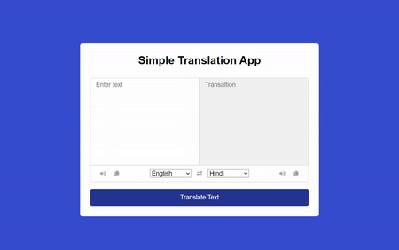

### Translator App

## Description
- A Translating Language App similar to google translation. The user can easily translate in different language and even hear how it sounds like.

## Features
- Language translation in many different language
- Copy the translated text
- Listent to the text in speech
- Exchange the primary language 
- Either press the button or press enter to translate

## Filtering the data

## Technologies
- HTML
- CSS
- JavaScript
- Fetch data from API endpoints. 
- Node (npm)
- Visual Studio Code (JavaScript IDE)
- Font Awesome (font and icons)
